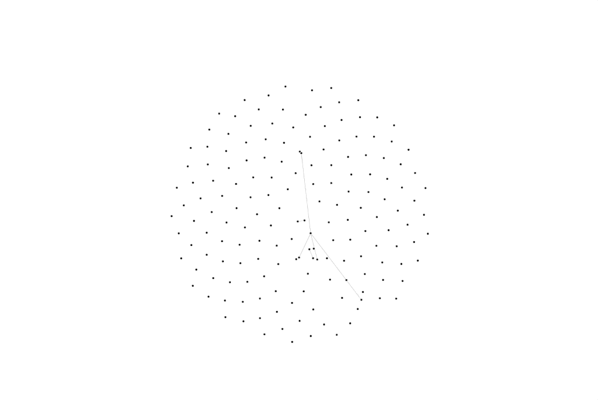
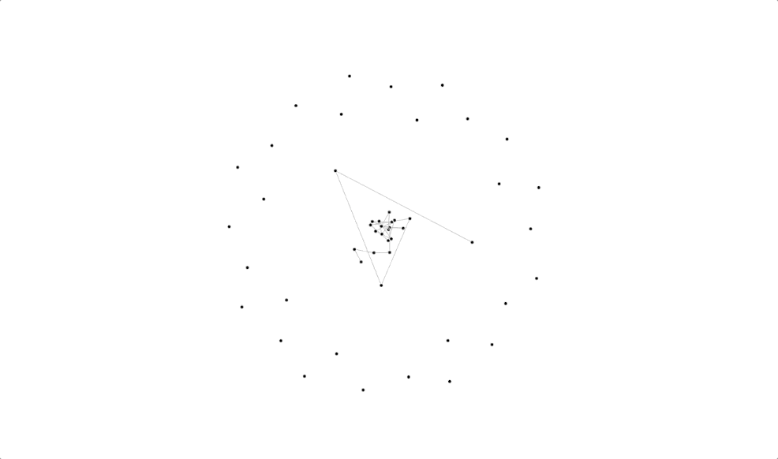

## React Animated Charts

## Install

Install the package using npm:

### `npm i react-animated-web`


## Force-Directed Graph



```javascript
import { ForceDirectedGraph } from "react-animated-web"; // ES6 Syntax

<ForceDirectedGraph
    drag={true}         // Enables Mouse Drag (true/false)
    nodes={node}        // Graph Nodes (Array of Object)
    links={link}        // Graph Links (Array of Object)
    alphaDecay={0.01}   // Alpha Decay (Number Range - [0,1])
    animationDelay={10} // Animation Delay Time (Time in `ms`)
    animationStart={0}  // Animation Start time (Time in `ms`)
    height={500}        // Height of Graph (Number)
    width={500}         // Width of Graph (Number)
    strength={0.4}      // Strength of Graph (Number Range - [0,1])
    distance={10}       // Distance between each node (Number)
/>
```

### Note

```javascript
const node = [{tag: "_name",id: "_id"}...]
const link = [{target: "_targetIndex", source: "_sourceIndex"}...]
```


## Hamiltonian Graph



```javascript
import { HamiltonianGraph } from "react-animated-web"; // ES6 Syntax

<HamiltonianGraph
    drag={true}         // Enable Mouse Drag (true/false)
    noOfNode={50}       // Graph Nodes (Number)
    linkFactor={10}     // Graph Links (Number)
    alphaDecay={0.01}   // Alpha Decay (Number Range - [0,1])
    animationDelay={10} // Animation Delay Time (Time in `ms`)
    animationStart={0}  // Animation Start time (Time in `ms`)
    height={500}        // Height of Graph (Number)
    width={500}         // Width of Graph (Number)
    strength={0.4}      // Strength of Graph (Number Range - [0,1])
    distance={10}       // Distance between each node (Number)
/>
```

### Note

```javascript
const node = [{tag: "_name",id: "_id"}...]
const link = [{target: "_targetIndex", source: "_sourceIndex"}...]
```


## Bubble Chart


```javascript
import { BubbleChart } from "react-animated-web"; // ES6 Syntax

<BubbleChart
    height={500}                // Height of Graph (Number)
    width={500}                 // Width of Graph (Number)
    tooltipSize={10}            // Tooltip text Size (Number)
    tooltipColor={'black'}      // Tooltip text Color (String)
    tooltipFont={"sans-serif"}  // Tooltip text Font (String)
    chartData={[]}              // Chart Data (Array)
    colourSet={[]}              // Chart Colour set (Array)
    fillOpacity={0.7}           // Fill Opacity (Number Range - [0,1])
/>
```

### Note

```javascript
const chartData = [{ name: "_name", group: "_group", value: _value }...]
const colourSet = ['#000','balck',...]
```
